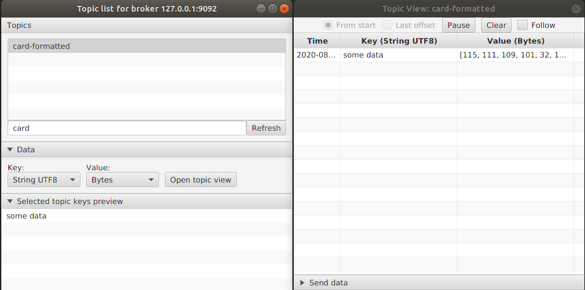

# kafka-topic-ui

UI for viewing or publishing events on a kafka topics built on OpenJFX11 and Kotlin. All the threading on the application
is backed up by coroutines.

It uses the kafka client version 2.2.0.



# Run the UI

- Install JDK11
  
  Required because JavaFx is not distributed evenly across operating systems on JDK8.

- `gradlew run`

## SSL login

Although the UI is a bit rough around the edges it is possible to login to a secured
kafka environment with client certificates.

Just chose `SSL` security and pick the certificate files.

#### Building the server key pair

**Very important: Use the `keytool` provided with the JDK. Linux distros have it too but they are different versions
and support different store types.
Secure sockets are very nitpicky with cryptic error messages, so minimize the issues by using the proper tool.
Thank me later**

Just ignore the warning about JSK being proprietary. You'll use this in Java processes anyway.

Create the CA to sign and validate the certificates. Snippets expect the `$PASSWD` env to exit.
```shell
openssl req -new -x509 -days 365 -keyout ca.key -out ca.crt -subj "/C=PT/L=Lisbon/CN=Certificate Authority" -passout pass:$PASSWD
```

Create the server keystore. Don't bother with the SAN names yet because they are rewritten when signing the CSR.
```shell
keytool -genkey -keystore server.keystore -alias localhost -dname CN=localhost -keyalg RSA -validity 365 -storepass $PASSWD
```

Create the certificate request and signs it. In this step we will need the actual SAN defined.
```shell
keytool -certreq -keystore server.keystore -alias localhost -file server.unsigned.crt -storepass $PASSWD
cat << EOF > openssl.signing.conf
[kafka_req]
subjectAltName = @alt_names
[alt_names]
DNS.1 = kafka-broker-1
DNS.2 = kafka-broker-2
DNS.3 = localhost
EOF
openssl x509 -req -CA ca.crt -CAkey ca.key -in server.unsigned.crt -out server.crt -days 365 -CAcreateserial -extfile openssl.signing.conf -extensions kafka_req -passin pass:$PASSWD
```

Import the CA certificate and the signed server certificate
```shell
keytool -import -file ca.crt -keystore server.keystore -alias ca -storepass $PASSWD -noprompt
keytool -import -file server.crt -keystore server.keystore -alias localhost -storepass $PASSWD -noprompt
```

Create the client truststore with the CA certificate
```shell
keytool -import -file ca.crt -keystore client.truststore -alias ca -storepass $PASSWD -noprompt
```

## Views

### Topic list view

Lists available topics on the broker and provides a preview window with the first records keys.

The user can then chose a topic, the deserializer to use and open a topic detail view.

### Topic detail view

Subscribes to a topic with read/write capabilities.

Reads can start at the beginning of the topic or at the last registered commit for the consumer. The user can pause
and resume polls.

Writes are done by reading files on the machine for key and value.

It is also possible to save the byte contents of the record by clicking with the
secondary mouse button.

## Features to come

- Create/Delete topics
- Finish custom deserializers
- Save preferences to a file
    - User defined application id
